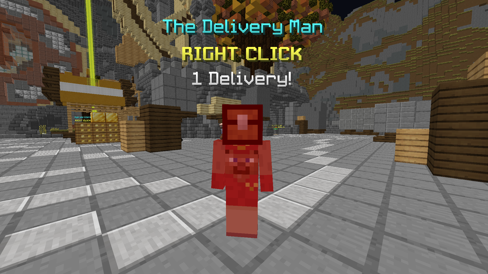
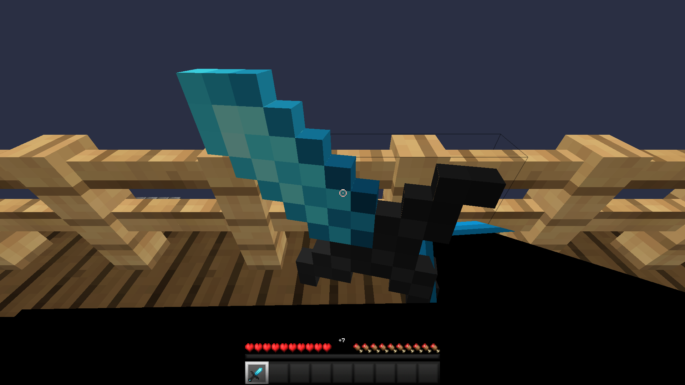
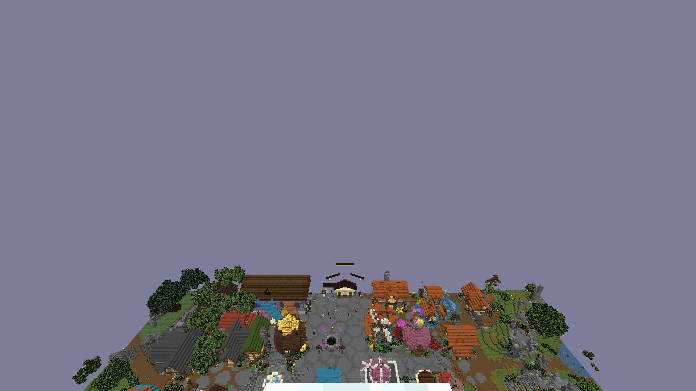
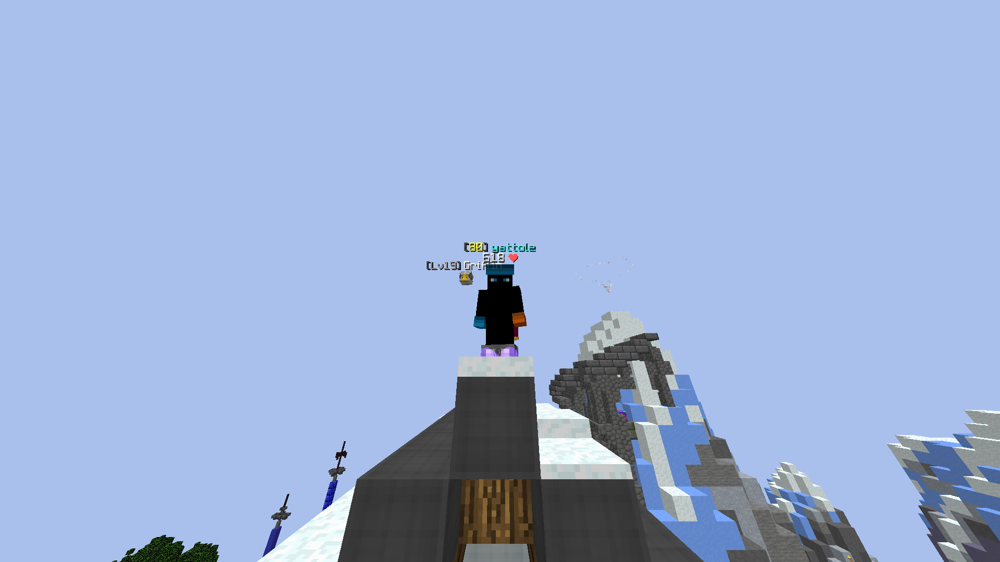
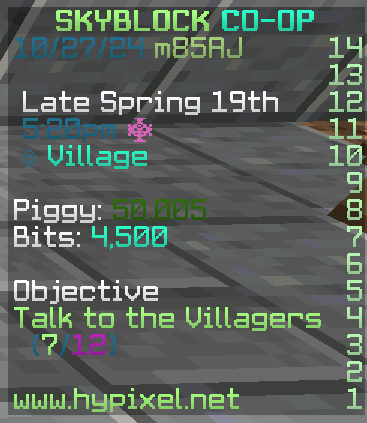
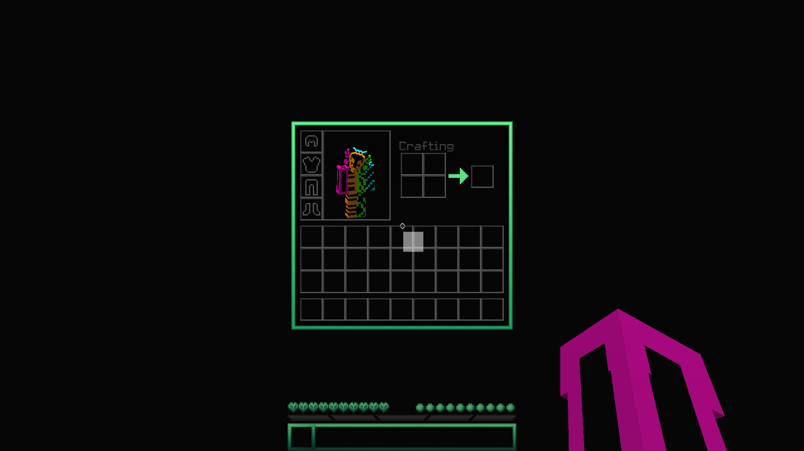
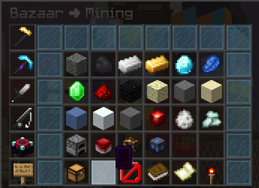
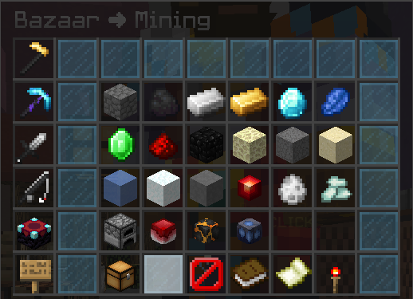
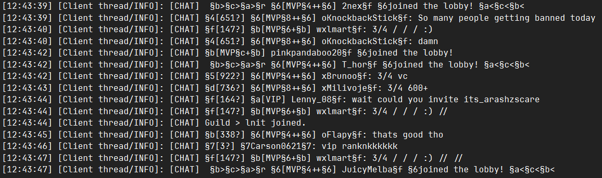
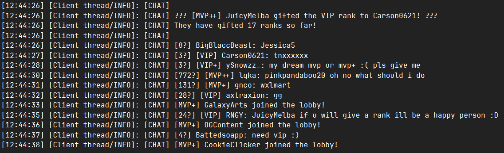

# Finement

Refines some of the game with fixes and gameplay changes

## Features

### Gameplay

Client-Side Hurt Animation

Plays the hurt animation client-side when attacking entities. 
Note that this occurs on all entities, use 'Only Enable on Real Players' to reduce it to just other players.

0th Person Perspective

Press to go into an inaccessible and freaky looking perspective mode.

Perspective Dependant FOVs

Allows you to set specific FOVs for different perspectives.

Custom Color Codes

Allows you to set custom colors for different colors and their shadows.

### Inventory

Smooth Slot Hovering

Draws square highlights at your mouse instead of snapping to slots.

Snap Item Rendering

Snaps your held item in inventories to the currently hovered slot.

Don't Render Empty Tooltips

Don't render empty tooltips. 
Requires advanced tooltips (F3+H) to be off.

### Other

Silently Decline Server Resource Packs

Silently decline server resource packs, but tell the server that you successfully downloaded them.
You can add a chat message to tell when a server tries to send you a resource pack.

Unformat Chat Logs

Properly removes formatting from chat messages before logging them.

Hide Missing Signature Errors

Hides "Signature is missing from textures payload" errors from being logged.

